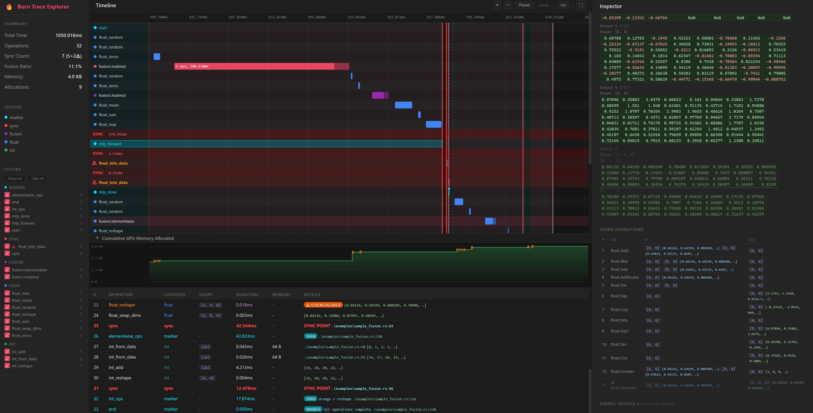

# Tracing backend for Burn Deep Learning Framework

A backend decorator for [Burn](https://burn.dev) that traces every tensor operation with CPU timing, detects GPU synchronization points, captures fusion blocks, and generates interactive HTML visualizations for performance analysis.



## Features

- **Operation tracing** — records every float, int, bool, module, and activation operation with precise CPU-side timing
- **Fusion block detection** — identifies ElementWise, Matmul, Reduce, and ReduceBroadcasted fusions, including which ops were fused and fallback ops that ran as separate kernels
- **Kernel tracing** — captures compiled kernel sources from CubeCL compilation, attached to fusion events for inspection (opt-in via `trace-data` feature)
- **Tensor shape tracking** — records input and output shapes for every operation and fusion block
- **Memory allocation tracking** — estimates memory allocations in bytes with per-operation timing
- **Optional tensor data capture** — previews up to N tensor values per operation (configurable, opt-in via `trace-data` feature)
- **Call site tracking** — captures `file:line:col` of the calling code via backtrace (opt-in via `trace-caller` feature, not available for fused ops)
- **Custom markers and spans** — insert markers and timed spans with debug strings, binary data, and tensor attachments
- **GPU sync point detection** — explicit (`sync()`) and implicit (`into_data()`) synchronization points are highlighted on the timeline. `into_data` forces a GPU flush and readback, shown clearly on the graph
- **Statistics** — total wall time, operation counts by category, GPU sync count, fusion ratio, allocation estimates, memory totals
- **Filters** — toggle operation categories on/off in the interactive timeline UI
- **Interactive timeline + operation list** — zoomable, pannable HTML visualization with search, inspector panel, kernel source viewer, and statistics sidebar

## Quick Start

Add to your `Cargo.toml`:

```toml
[dependencies]
burn-tracing-backend = { git = "https://github.com/AdrianEddy/burn-tracing-backend.git", features = ["fusion", "trace-caller", "trace-data"] }
```

> [!WARNING]
> `trace-data` adds significant overhead - use only for small models or targeted debugging.

### Feature Flags

| Feature | Description |
|---|---|
| `fusion` | Fusion-aware profiling — intercepts CubeCL fusion dispatch to detect fused kernels |
| `trace-caller` | Captures caller file + line via backtrace for each operation |
| `trace-data` | Captures tensor value previews (default: first 64 elements per tensor) |

## Usage

### Basic Profiling (with Fusion)

```rust
use burn::backend::wgpu::{CubeBackend, WgpuRuntime};
use burn::prelude::*;
use burn_fusion::Fusion;
use burn_tracing_backend::{Profiler, start_tracing, finish_tracing, write_trace, marker};

// Profiler sits inside the Fusion layer to intercept fusion dispatch
type B = Fusion<Profiler<CubeBackend<WgpuRuntime>>>;

fn main() {
    let device = Default::default();

    // Start recording
    start_tracing();

    // Your operations are traced automatically
    let a: Tensor<B, 2> = Tensor::random([8, 8], Distribution::Uniform(0.0, 1.0), &device);
    let b: Tensor<B, 2> = Tensor::random([8, 8], Distribution::Uniform(0.0, 1.0), &device);
    let c = a.clone().add(b.clone()).mul(a.clone()).exp();

    // Explicit GPU sync — shows as a sync point on the timeline
    B::sync(&device).unwrap();

    // Implicit GPU sync — into_data() forces flush, also shown on the timeline
    let _data = c.to_data();

    // Collect events and write HTML + JS visualization
    let events = finish_tracing();
    write_trace(&events, "trace_data.js").unwrap();
    // Open trace_explorer.html in a browser
}
```

### Custom Markers and Spans

```rust
use burn_tracing_backend::marker;

// Instant marker — appears as a vertical line on the timeline
marker("checkpoint").debug("Epoch 5 complete, loss=0.032").emit();

// Timed span — measures duration from creation to drop
{
    let _span = marker("forward_pass").debug("Layer 1 → 2 → output").span();
    // ... operations run here ...
} // span duration recorded on drop

// Attach tensor data to markers
marker("output")
    .tensor::<B>(&result.clone().into_primitive().tensor())
    .debug(format!("shape: {:?}", result.dims()))
    .emit();

// Add tensor data to spans after they start
let mut span = marker("inference").span();
// ... compute ...
span.add_tensor::<B>(&output.clone().into_primitive().tensor());
span.set_debug("batch complete");
drop(span);
```

### Configuring Data Capture

```rust
use burn_tracing_backend::set_data_capture_limit;

// Capture first 128 values per tensor (default: 64, 0 = disabled)
set_data_capture_limit(128);
```

## Example: Tracing Fusion Operations

A self-contained example that exercises elementwise fusion, matmul fusion, reductions, sync points, and markers:

```rust
use burn::backend::wgpu::{CubeBackend, WgpuRuntime};
use burn::prelude::*;
use burn_fusion::Fusion;
use burn_tracing_backend::{Profiler, start_tracing, finish_tracing, write_trace, marker, OpCategory};

type B = Fusion<Profiler<CubeBackend<WgpuRuntime>>>;

fn main() {
    let device = Default::default();
    start_tracing();

    marker("begin").debug("Fusion tracing demo").emit();

    // --- Elementwise fusion chain ---
    {
        let _span = marker("elementwise").debug("add → mul → exp chain").span();
        let a: Tensor<B, 2> = Tensor::random([4, 16], Distribution::Normal(0.0, 1.0), &device);
        let b: Tensor<B, 2> = Tensor::random([4, 16], Distribution::Normal(0.0, 1.0), &device);
        let c = a.clone().add(b).mul(a).exp().log().abs();
        B::sync(&device).unwrap(); // explicit sync
    }

    // --- Matmul fusion ---
    {
        let _span = marker("matmul").debug("linear layer: matmul + bias + relu").span();
        let x: Tensor<B, 2> = Tensor::random([4, 16], Distribution::Normal(0.0, 1.0), &device);
        let w: Tensor<B, 2> = Tensor::random([16, 8], Distribution::Normal(0.0, 0.1), &device);
        let bias: Tensor<B, 1> = Tensor::zeros([8], &device);
        let out = x.matmul(w).add(bias.unsqueeze()).clamp_min(0.0);
        B::sync(&device).unwrap();
    }

    // --- Reductions ---
    {
        let _span = marker("reductions").span();
        let t: Tensor<B, 2> = Tensor::random([8, 8], Distribution::Uniform(0.0, 1.0), &device);
        let _mean = t.clone().mean();
        let _sum = t.clone().sum();
        B::sync(&device).unwrap();
    }

    // --- Implicit sync via into_data ---
    let result: Tensor<B, 2> = Tensor::ones([2, 2], &device);
    let _data = result.to_data(); // implicit GPU sync shown on timeline

    marker("end").emit();

    let events = finish_tracing();

    // Print summary
    let total_us: f64 = events.iter().map(|e| e.duration_us).sum();
    let fusions = events.iter().filter(|e| e.category == OpCategory::Fusion).count();
    let syncs = events.iter().filter(|e| e.is_sync == Some(true)).count();
    println!("Events: {}, Fusions: {}, Syncs: {}, Total: {:.0}us", events.len(), fusions, syncs, total_us);

    for e in &events {
        if let Some(kind) = &e.fusion_kind {
            println!("  {:?} — {} ops fused, {:.1}us", kind, e.num_fused_ops.unwrap_or(0), e.duration_us);
        }
    }

    // Write visualization
    write_trace(&events, "trace_data.js").unwrap();
    println!("Open trace_explorer.html in a browser to explore the trace.");
}
```

Run it:

```bash
cargo run --example sample_fusion --features "fusion,trace-caller,trace-data"
```

## Visualization

`write_trace` outputs two files side by side:

- **`trace_data.js`** — serialized trace events (`const TRACE_DATA = [...]`)
- **`trace_explorer.html`** — interactive trace explorer UI (embedded in the crate)

Open `trace_explorer.html` in any browser. The UI provides:

- **Timeline** — color-coded operations with zoom and pan
- **Statistics sidebar** — operation counts, timing breakdown, fusion ratio
- **Category filters** — toggle Float, Int, Bool, Module, Activation, Sync, Fusion, Marker visibility
- **Inspector panel** — click any event to see shapes, timing, caller location, kernel source, and tensor data previews

## Disclaimer

Most of the code was generated by Claude Opus 4.6 with a strong human guidance and validation

## License

The Unlicense
